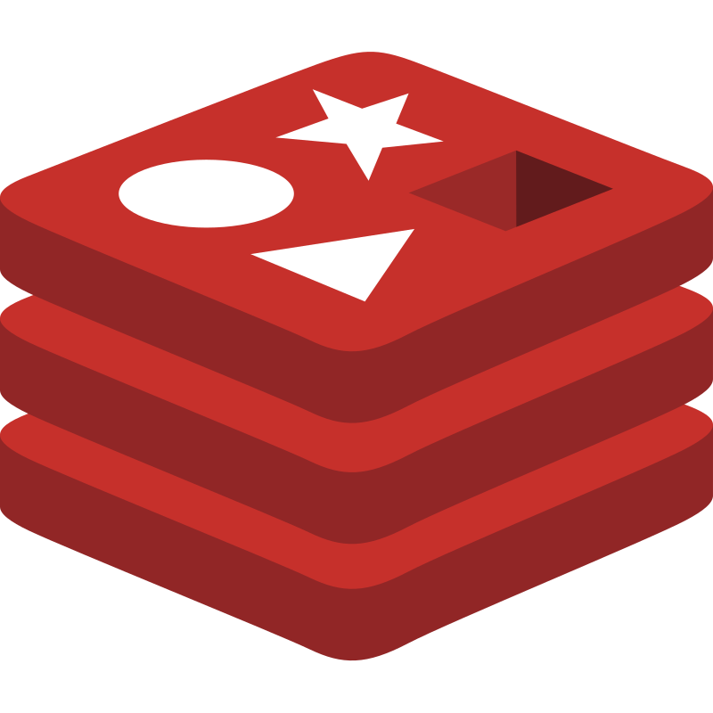
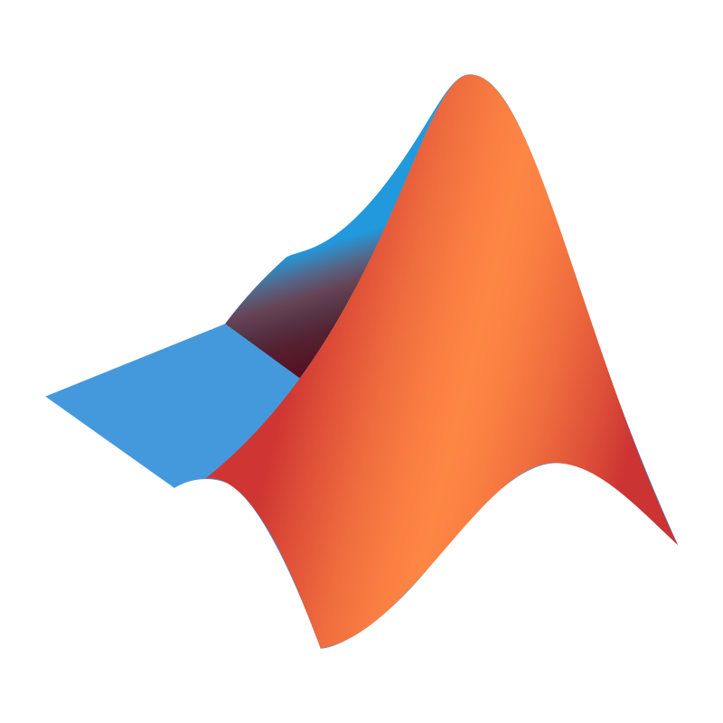

# matyo-17


```php
class AboutMe {
    protected string $base = "malaysia";
    protected string $first_name = "Filson";
    protected string $last_name = "Teo";
    protected string $email = "filsonteo@gmail.com";
    protected string $description = "a software developer";
    protected string $website = "https://matyo-17.github.io/";
    protected array $fav_programming_lang = ["php", "python", "javascript"];
    protected array $fields_interested = [
        "software development", "artificial intelligence", "machine learning",
        "robotics", "image processing",
    ];
    protected array $open_sources = [
        "https://github.com/matyo-17/mysql-backup",
        "https://github.com/matyo-17/fotmob-sdk",
    ];

    public function introduce(): string {
        $string = "<p>Name: ".$this->get_name()."</p>";
        $string .= "<p>Overview: ".$this->description."</p>";
        $string .= "<p>Based in: ".ucfirst($this->base)."</p>";
        $string .= "<p>Website: ".$this->get_website()."</p>";
        $string .= "<p>Email: ".$this->email."</p>";
        $string .= "<p>Fields interested: ".$this->get_fields_interested()."</p>";
        $string .= "<p>Favourite programming language: ".$this->get_fav_programming_lang()."</p>";
        $string .= "<p>Open sources: ".$this->get_open_sources()."<br>";
        return $string;
    }

    private function get_name(): string {
        return $this->first_name." ".$this->last_name;
    }

    private function get_website(): string {
        return "<a href='".$this->website."'>".$this->website."</a>";
    }

    private function get_fav_programming_lang(): string {
        $string = "";
        foreach ($this->fav_programming_lang as $lang) {
            $string .= $lang.", ";
        }
        return substr($string, 0, -2);
    }

    private function get_fields_interested(): string {
        $string = "<ul>";
        foreach ($this->fields_interested as $field) {
            $string .= "<li>".$field."</li>";
        }
        $string .= "</ul>";
        return $string;
    }

    private function get_open_sources(): string {
        $string = "<ul>";
        foreach ($this->open_sources as $link) {
            $string .= "<li><a href='".$link."'>".$link."</a></li>";
        }
        $string .= "</ul>";
        return $string;
    }
}

$about_me = new AboutMe();
echo $about_me->introduce();
```

### 🔨 Language & Tools

<a href="https://www.php.net/">
    
</a>&nbsp;
<a href="https://www.python.org/">
    
</a>&nbsp;
<a href="https://www.cprogramming.com/">
    
</a>&nbsp;
<a href="https://www.java.com/en/">
    
</a>
&nbsp;
<a href="https://laravel.com/">
    
</a>&nbsp;
<a href="https://www.djangoproject.com/">
    
</a>&nbsp;
<a href="https://fastapi.tiangolo.com/">
    
</a>&nbsp;
<a href="https://pandas.pydata.org/">
    
</a>
&nbsp;
<a href="https://www.mysql.com/">
    
</a>&nbsp;
<a href="https://www.sqlite.org/">
    
</a>&nbsp;
<a href="https://redis.io/">
    
</a>&nbsp;
<a href="https://www.javascript.com/">
    
</a>&nbsp;
<a href="https://html.spec.whatwg.org/multipage/">
    
</a>&nbsp;
<a href="https://www.w3.org/Style/CSS/Overview.en.html">
    
</a>&nbsp;
<a href="https://nginx.org/en/">
    
</a>&nbsp;
<a href="https://httpd.apache.org/">
    
</a>&nbsp;
<a href="https://www.docker.com/">

</a>&nbsp;
<a href="https://git-scm.com/">
    
</a>&nbsp;
<a href="https://github.com/">
    
</a>&nbsp;
<a href="https://about.gitlab.com/">

</a>&nbsp;
<a href="https://code.visualstudio.com/">
    
</a>&nbsp;
<a href="https://www.postman.com/">
    
</a>&nbsp;
<a href="https://www.mathworks.com/products/matlab.html">
    
</a>&nbsp;
<a href="https://www.haskell.org/">
    
</a>&nbsp;

---
Made with ❤️ by [@matyo-17](https://github.com/matyo-17)

<!--
**matyo-17/matyo-17** is a ✨ _special_ ✨ repository because its `README.md` (this file) appears on your GitHub profile.

Here are some ideas to get you started:

- 🔭 I’m currently working on ...
- 🌱 I’m currently learning ...
- 👯 I’m looking to collaborate on ...
- 🤔 I’m looking for help with ...
- 💬 Ask me about ...
- 📫 How to reach me: ...
- 😄 Pronouns: ...
- ⚡ Fun fact: ...
-->
