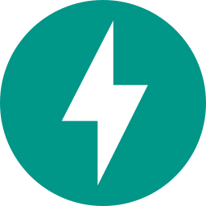

## matyo-17 

```php
class AboutMe {
    protected string $base = "malaysia";
    protected string $first_name = "Filson";
    protected string $last_name = "Teo";
    protected string $email = "filsonteo@gmail.com";
    protected string $description = "a software developer";
    protected string $website = "https://matyo-17.github.io/";
    protected string $linkedin = "https://www.linkedin.com/in/filson-teo-7a380a20b/";
    protected array $fav_programming_lang = ["php", "python", "javascript"];
    protected array $fields_interested = [
        "software development", "artificial intelligence", "machine learning",
        "robotics", "image processing",
    ];
    protected array $open_sources = [
        "https://github.com/matyo-17/mysql-backup",
        "https://github.com/matyo-17/docker-laravel-stack",
    ];

    public function introduce(): string {
        $string = "<p>Name: ".$this->get_name()."</p>";
        $string .= "<p>Overview: ".$this->description."</p>";
        $string .= "<p>Based in: ".ucfirst($this->base)."</p>";
        $string .= "<p>Website: ".$this->get_links("website")."</p>";
        $string .= "<p>LinkedIn: ".$this->get_links("linkedin")."</p>";
        $string .= "<p>Email: ".$this->email."</p>";
        $string .= "<p>Fields interested: ".$this->array_to_string("fields_interested", true)."</p>";
        $string .= "<p>Favourite programming language: ".$this->array_to_string("fav_programming_lang")."</p>";
        $string .= "<p>Open sources: ".$this->array_to_string("open_sources", true, true)."<p>";
        $string .= "<br>";
        $string .= "<p>This is a summary of me. Visit my website for more details.</p>";
        return $string;
    }

    private function get_name(): string {
        return $this->first_name." ".$this->last_name;
    }

    private function get_links(string $purpose): string {
        return "<a href='".$this->$purpose."'>".$this->$purpose."</a>";
    }

    private function array_to_string(string $var, bool $list=false, bool $links=false): string {
        $string = ($list) ? "<ul>" : "";
        foreach ($this->{$var} as $e) {
            $string .= ($list) ? "<li>" : "";
            $string .= ($links) ? "<a href='".$e."'>" : "";
            $string .= $e.((!$list) ? ", " : "");
            $string .= ($links) ? "</a>" : "";
            $string .= ($list) ? "</li>" : "";
        }
        return ($list) ? $string."</ul>" : substr($string, 0, -2);
    }
}

echo (new AboutMe())->introduce();
```

### 🔨 Language & Tools

<a href="https://www.php.net/">
    
</a>
<a href="https://www.python.org/">
    
</a>
<a href="https://www.cprogramming.com/">
    
</a>
<a href="https://www.java.com/en/">
    
</a>
<a href="https://laravel.com/">
    
</a>
<a href="https://www.djangoproject.com/">
    
</a>
<a href="https://fastapi.tiangolo.com/">
    
</a>
<a href="https://numpy.org/">
    
</a>
<a href="https://pandas.pydata.org/">
    
</a>
<a href="https://www.selenium.dev/">
    
</a>
<a href="https://www.mysql.com/">
    
</a>
<a href="https://www.sqlite.org/">
    
</a>
<a href="https://redis.io/">
    
</a>
<a href="https://www.javascript.com/">
    
</a>
<a href="https://html.spec.whatwg.org/multipage/">
    
</a>
<a href="https://www.w3.org/Style/CSS/Overview.en.html">
    
</a>
<a href="https://nginx.org/en/">
    
</a>
<a href="https://httpd.apache.org/">
    
</a>
<a href="https://www.docker.com/">

</a>
<a href="https://git-scm.com/">
    
</a>
<a href="https://github.com/">
    
</a>
<a href="https://about.gitlab.com/">

</a>
<a href="https://code.visualstudio.com/">
    
</a>
<a href="https://www.postman.com/">
    
</a>
<a href="https://www.mathworks.com/products/matlab.html">
    
</a>
<a href="https://www.haskell.org/">
    
</a>

<!--
**matyo-17/matyo-17** is a ✨ _special_ ✨ repository because its `README.md` (this file) appears on your GitHub profile.

Here are some ideas to get you started:

- 🔭 I’m currently working on ...
- 🌱 I’m currently learning ...
- 👯 I’m looking to collaborate on ...
- 🤔 I’m looking for help with ...
- 💬 Ask me about ...
- 📫 How to reach me: ...
- 😄 Pronouns: ...
- ⚡ Fun fact: ...
-->
